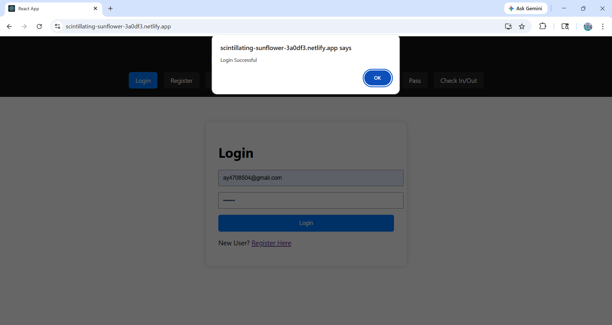
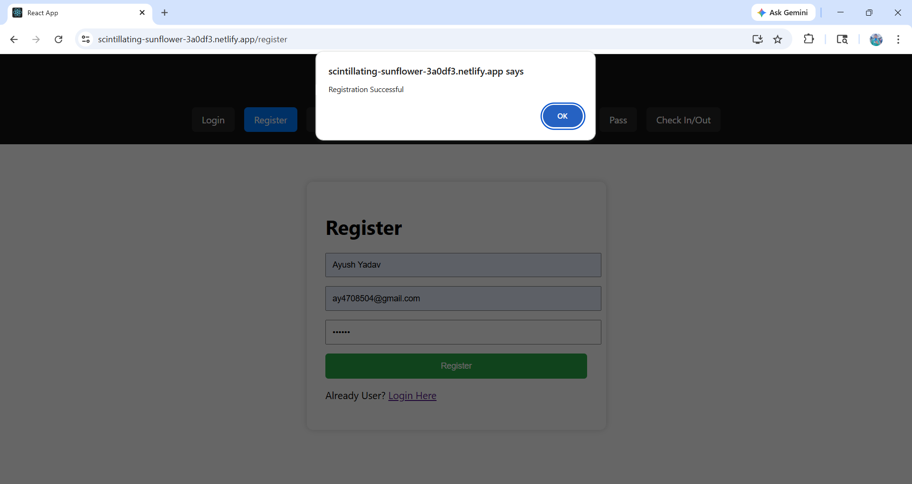
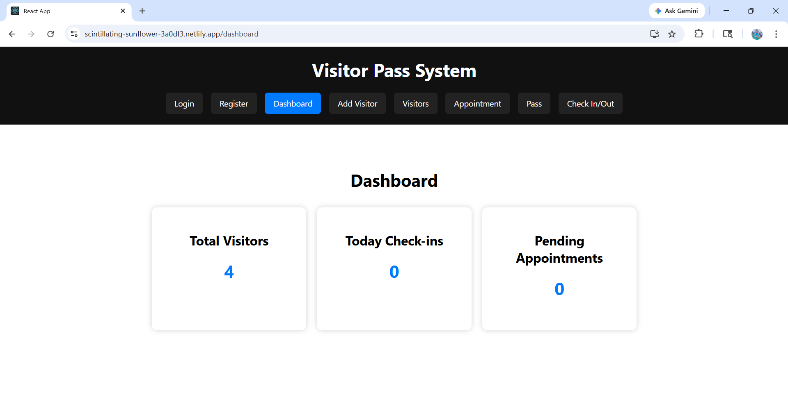
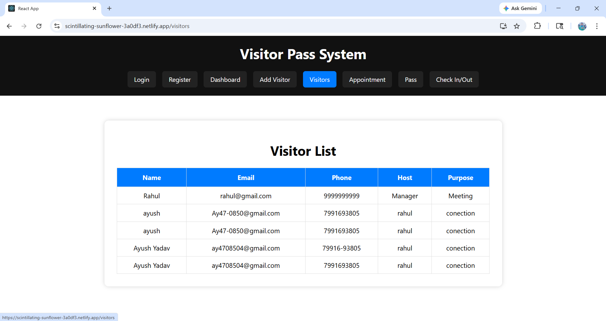
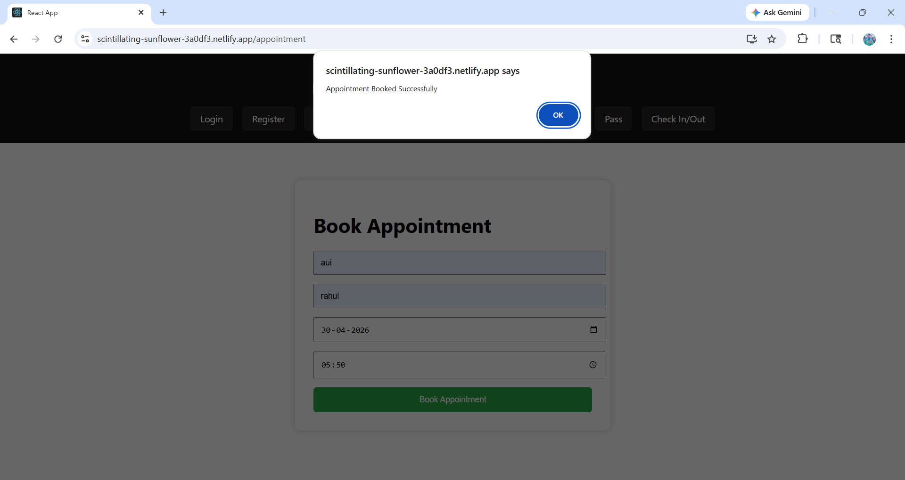
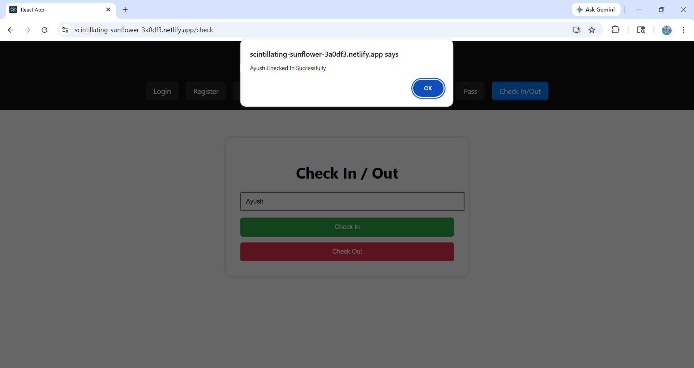

# Visitor Pass Management System (MERN)

A full-stack Visitor Pass Management System built using MERN Stack (MongoDB, Express.js, React.js, Node.js).

This system helps offices and organizations manage visitors digitally with registration, pass generation, appointments, check-in/check-out and dashboard reports.

---

## 🚀 Live Demo

Frontend: https://scintillating-sunflower-3a0df3.netlify.app/

Backend API: https://visitor-pass-system-srj7.onrender.com/

---

## 📌 Features

- User Registration & Login
- JWT Authentication
- Dashboard Analytics
- Add Visitors
- Visitor List
- Book Appointment
- Generate Visitor Pass
- QR Code Pass
- Check In / Check Out
- Responsive UI
- MERN Full Stack Deployment

---

## 🛠 Tech Stack

### Frontend
- React.js
- CSS
- Axios
- React Router

### Backend
- Node.js
- Express.js
- MongoDB
- JWT
- bcryptjs

### Database
 -mongoDB
  

## 📷 Screenshots

### Login

### Register

### Dashboard

### Add Visitor

### Pass

### Appointment

### Check In

### Check Out

### Visitor

---

## 🎥 Demo Video

Video available inside project folder:

video demo/Screen Recording.mp4

---

## 📂 Folder Structure

client/ → Frontend  
Server/ → Backend  
Screenshot/ → Images  
video demo/ → Demo Video

---

## 👨‍💻 Author

Ayush Yadav

---

## ⭐ Project Status

Completed Successfully