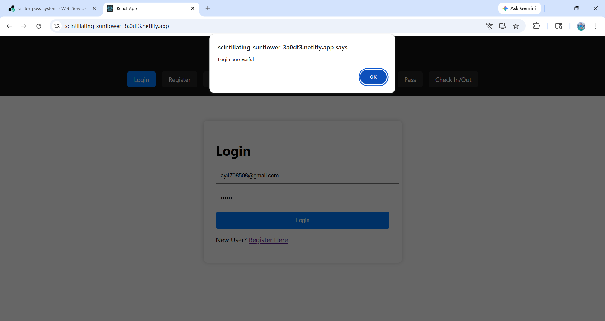
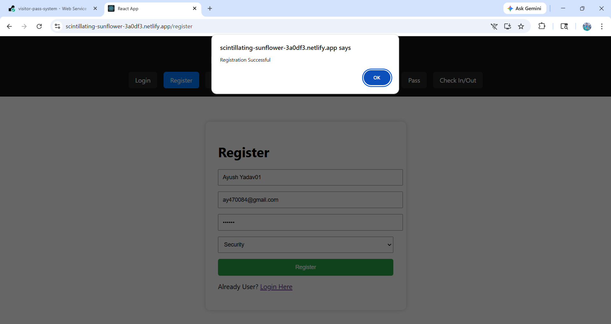
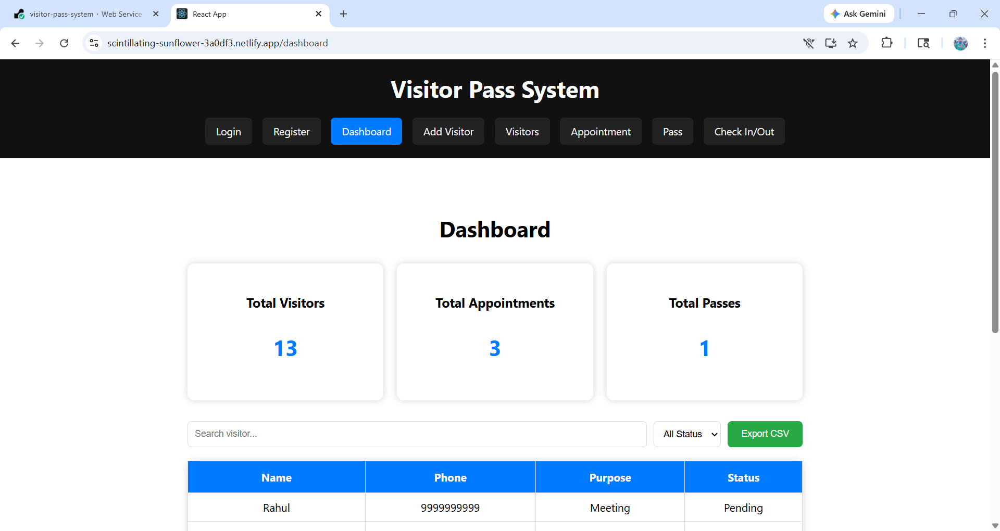
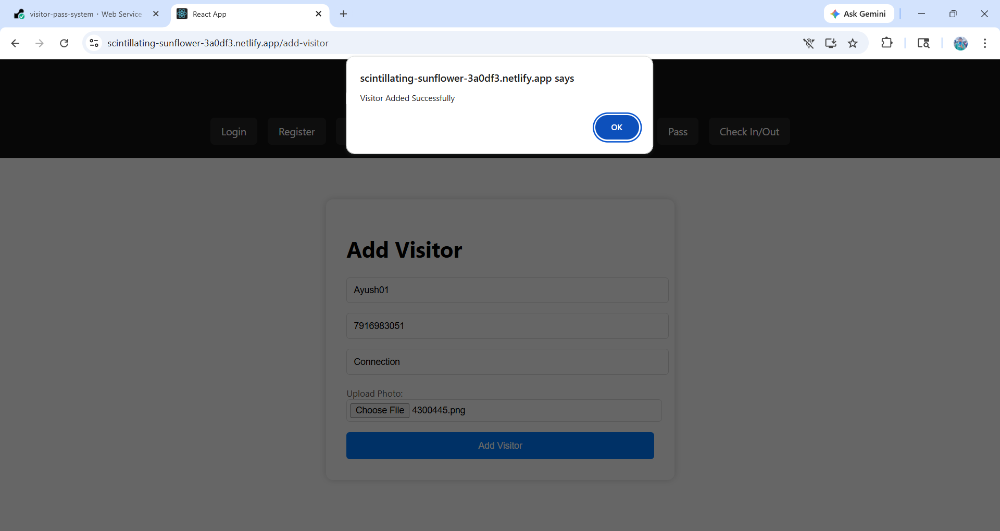
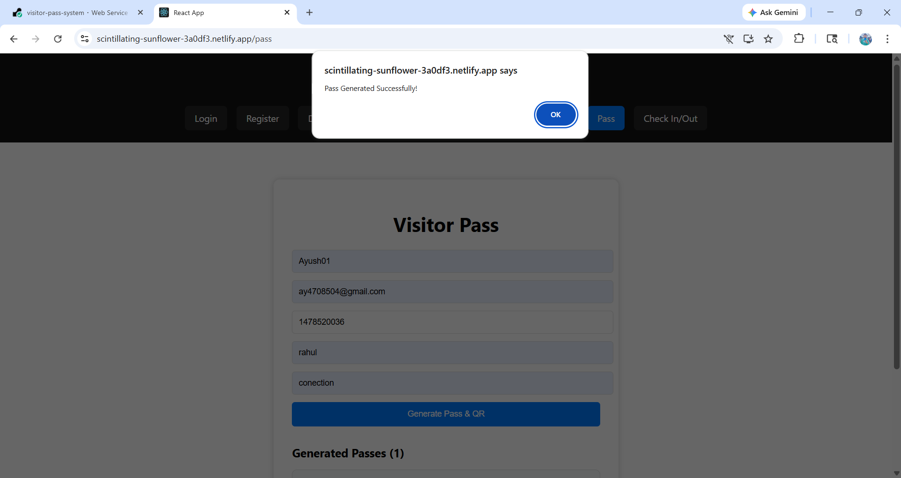
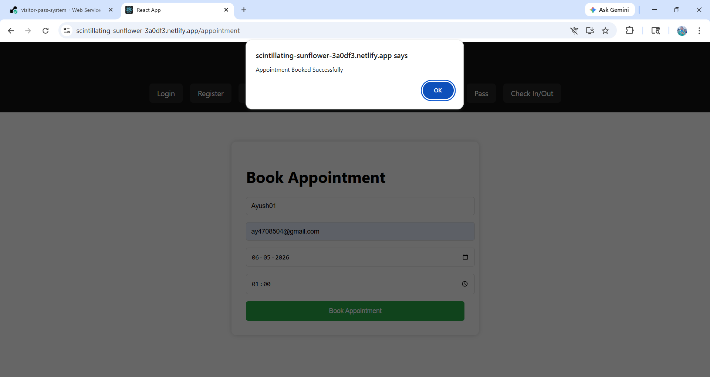
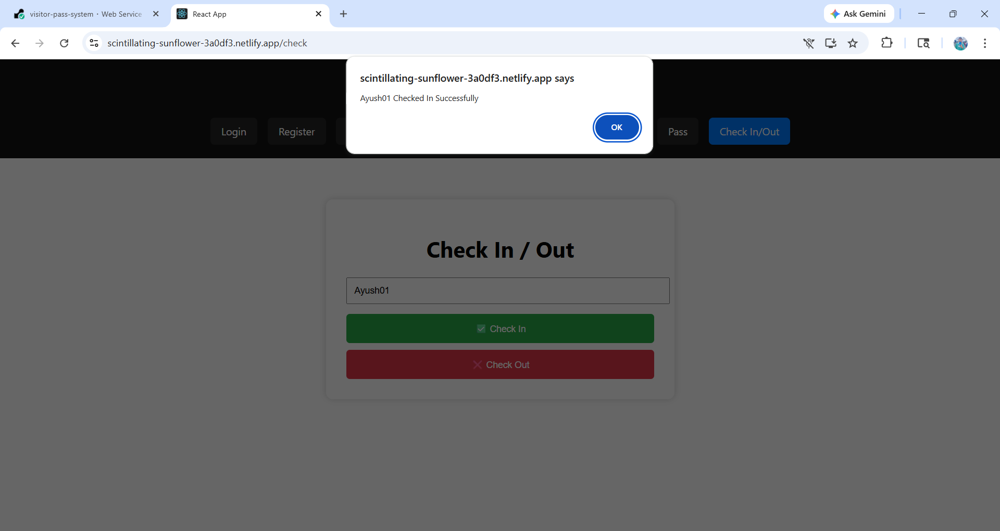
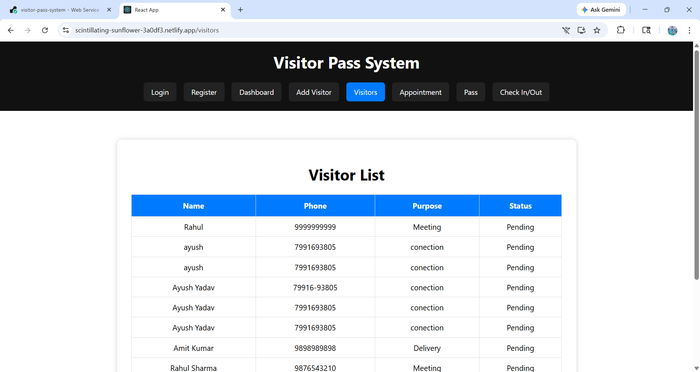

  # Visitor Pass Management System (MERN)

 A full-stack Visitor Pass Management System built using MERN Stack (MongoDB, Express.js, React.js, Node.js).
 This system helps offices and organizations manage visitors digitally with registration, pass generation, appointments, check-in/check-out and dashboard reports.

 ---

 ## 🚀 Live Demo

 Frontend: https://scintillating-sunflower-3a0df3.netlify.app/ 
 Backend API: https://visitor-pass-system-srj7.onrender.com/

 ---

 ## 📌 Features

- User Registration & Login (JWT Authentication)
- bcrypt Password Hashing
- Role-based Users (Admin, Security, Employee, Visitor)
- Dashboard Analytics with Search & Filter
- Export Visitors to CSV
- Add Visitors with Photo Upload
- Visitor List
- Book Appointment
- Generate Visitor Pass with QR Code
- Check In / Check Out
- Email Notifications (Nodemailer)
- Input Validation (express-validator)
- Protected Routes (JWT Middleware)
- Responsive UI
- MERN Full Stack Deployment

 ---

 ## 🛠 Tech Stack

 ### Frontend
 - React.js
 - Axios
 - React Router DOM
 - react-qr-code

 ### Backend
 - Node.js
 - Express.js
 - MongoDB Atlas
 - JWT (jsonwebtoken)
 - bcryptjs
 - Multer (photo upload)
 - Nodemailer (email notifications)
 - express-validator
 - QRCode
 - PDFKit

 ---

 ## 🔑 Environment Variables

 ### Backend (server/.env)
 MONGO_URI=your_mongodb_uri
 JWT_SECRET=your_jwt_secret
 PORT=5000

 ### Frontend (client/.env)
 REACT_APP_API_URL=http://localhost:5000

 ---

 ## ⚙️ How to Run Locally

 ### Backend
 cd server
 npm install
 npm start

 ### Frontend
 cd client
 npm install
 npm start

 ### Seed Demo Data
 cd server
 node seed.js

 ---

 ## 📷 Screenshots

### Login

### Register

### Dashboard

### Add Visitor

### Pass

### Appointment

### Check In

### Check Out

### Visitor

---

## 🎥 Demo Video
👉 Watch here:https://drive.google.com/file/d/1XDXdl4vvf2SElbByersgc4lwD7HC5rMy/view?usp=sharing

## 📂 Folder Structure

Visitor-Pass-System/
├── client/  Frontend 
├── Server/  Backend 
├── Screenshot/  Screenshots
└── video demo/  Demo Video

---

## 👨‍💻 Author

Ayush Yadav
GitHub: https://github.com/Ayush799169

---

## ⭐ Project Status

Completed Successfully ✅